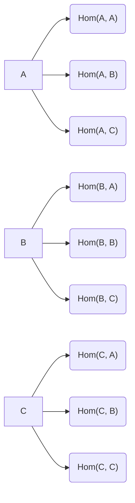
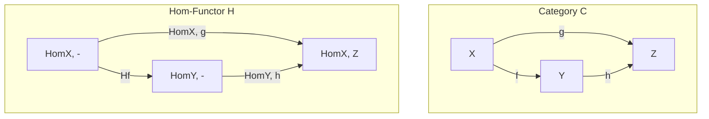

# Exploring Category Theory: Sets, Functors, and Natural Transformations
# Category of Sets
We define our Category of Sets
## Objects
Each object is a Set

## Identify Morphisms
Identity morphisms for each object A is id: A -> A
## Other Morphisms
Each morphism is a function from set A to set B

## Composition of Morphisms
A morphism is defined for each combination of morphisms that share the target
and source domain:

    f: A->B
    g: B->C

defined as as:
    h: A->C
    h:= g . f = g(f(x))

## Associativity of composition:
f . g . h : A -> B -> C -> D reduce to f(g(h(x))) regardless of the grouping of
composition.
    f . (g . h) = f (g ( h x))
    (f . g) . h = (f . g) (h (x)) = f(g(h(x)))

# Functors

Functors are mappings between categories that preserve the structure of the
categories, by way of mapping objects, morphisms and other laws of category
theory. There can be additional properties but the original properties are
preserved.

Or in other words, it is a way to inherit all properties of the original
(source) category and create a new (target) category.

In order to define a functor, we need to have two categories, a source category
and a target category, and a mapping between the objects and morphisms of the
source category to the objects and morphisms of the target category.

We will define 2 endofunctors, F and G of category Set.

## Functor F
For objects, the functor maps X to a the tuple that start with F:

    F(X) := (F, X)

For Morphisms, the result of function f will be wrapped in a tuple
    F(f) := lambda x: (F, f(x))

Now we can verify that F is a functor that preserves the structure of Category
of Set:

### F preserves objects:
(This preservation is not required for functors)
For any object X in C, F(X) is the corresponding set wrapped in the tuple (F, ).
This condition is automatically satisfied.

### F preserves morphisms:
(This preservation is not required for functors)
For any morphism f in C: F(f) is corresponding function wrapped in the tuple(F,
f(x)). This condition is automatically satisfied.

### F preserves composition:
(This preservation is required for functors)
For any pair of morphisms in C, f and g:

    let h := g . f

Then we have:

    F(h) = (F, h(x))
    F(f) = (F, f(x))
    F(g) = (F, g(x))

    F(g) . F(f) = (F, g.f(x))
                = (F, h(x))

    F(h) = F(g) . F(f)

### F preserves identity morphisms:
(This preservation is required for functors)
For any object X in C, the functor F maps the
identity morphism id_X by wrapping it as (F, id_X)
Thus, the condition is automatically satisfied.

## Functor G
Functor G is defined in exactly the same way as F, except that the tuples are
defined with (G,...) instead of (F, ...)

# Natural Transformation

A natural transformation is a way to relate two functors, say F and G, that map
between the same categories. In this case, both functors map from Category C to
the Category of Sets. To demonstrate a natural transformation around morphism f
of Category C, we need to find a family of morphisms (called natural
transformations) that satisfy certain conditions.

Let's consider any morphism f : A->B in Category C.

We need to define natural transformations α_A: F(A) -> G(A) and α_B: F(B) ->
G(B) in such a way that they satisfy the naturality condition:

α_B ∘ F(f) = G(f) ∘ α_A

Let's define α_A and α_B as follows:

    α_A := lambda (F, x) : (G, x)
    α_B := lambda (F, x) : (G, f(x))

Calculate α_B ∘ F(f)(x):

    F(f)(x) = (F, f(x))
    α_B(F(f)(x)) = α_B(F, f(x)) = (G, f(x))

Calculate G(f) ∘ α_A(x):

    α_A(x) = α_A(F, x) = (G, x)
    G(f)(α_A(x)) = G(f)(x) = (G, f(x))

Now, let's compare the results:

    α_B ∘ F(f)(x) =  (G, f(x))
    G(f) ∘ α_A(x) =  (G, f(x))

Since α_B ∘ F(f)(x) = G(f) ∘ α_A(x) for all x in F(A), the naturality condition
is satisfied. Therefore, α_A and α_B form a natural transformation between
functors F and G.

# Yoneda Lemma
The Yoneda Lemma is a foundational result in category theory that provides a
deep insight into the structure of categories and their relationship with
functors. It connects a functor with a representable functor and natural
transformations, and shows that every natural transformation can be uniquely
determined by its action on a single object.

## Representable Functors
Representable functors are a special class of functors that can be associated
with an object in a category. In this discussion, we will explore the concept of
representable functors and their properties.

To illustrate representable functors, let's consider a category C and its
opposite category, C^op. The objects of C^op are the same as those in C, but the
arrows (morphisms) have their directions reversed.
## Hom-Functors
In the context of representable functors, we often deal with Hom-functors. A
Hom-functor is a functor that maps objects and morphisms of a category to the
set of morphisms (arrows) between those objects.

| Property             | Regular Functor                | Hom-Functor                                               |
|----------------------|---------------------------------|-----------------------------------------------------------|
| Domain               | Category C                      | Category C                                                |
| Codomain             | Category D                      | Category of Sets                                          |
| Objects in Target    | Objects in D                    | Sets of morphisms in C                                    |
| Maps objects         | Maps objects in C to objects in D  | Maps objects in C to sets of morphisms                   |
| Maps morphisms       | Maps morphisms in C to morphisms in D | Maps morphisms in C to functions between sets of morphisms |
| Composition law      | Preserves composition in C      | Preserves composition in C                                |
| Identity morphisms   | Preserves identity morphisms in C | Preserves identity morphisms in C                         |

If source had 3 objects, Hom-Functors will create 9 objects in the target
category as below

Contravariant Hom-Functor

The contravariant Hom-functor is denoted as Hom(A, -) and maps objects and morphisms in category C^op to the set of morphisms starting from object A in C. The Mermaid code for the diagram representing the contravariant Hom-functor is:

mermaid

graph LR
X((X)) <--|f| Y((Y))
Y <--|g| Z((Z))
subgraph Contravariant Hom-Functor Hom(A, -)
  HomX[Hom(A, X)]
  HomY[Hom(A, Y)]
  HomZ[Hom(A, Z)]
  Y -->|Hom(A, f)| HomX
  Z -->|Hom(A, g)| HomY
end

Representable Functor Definition

A functor F: C → Set (or C^op → Set) is called representable if it is isomorphic to a Hom-functor for some object A in C. In other words, there exists an object A in C such that F is naturally isomorphic to Hom(A, -) or Hom(-, A).
Example of a Representable Functor

Consider the category of finite sets, FinSet. Let's define a functor F: FinSet^op → Set that takes a finite set X and maps it to the set of all possible orderings (i.e., permutations) of X.

Now, let's consider the contravariant Hom-functor Hom(A, -), where A is a finite set with n elements. For any finite set X, Hom(A, X) represents the set of all functions from A to X. When X has n elements, there are n^n possible functions from A to X. Since