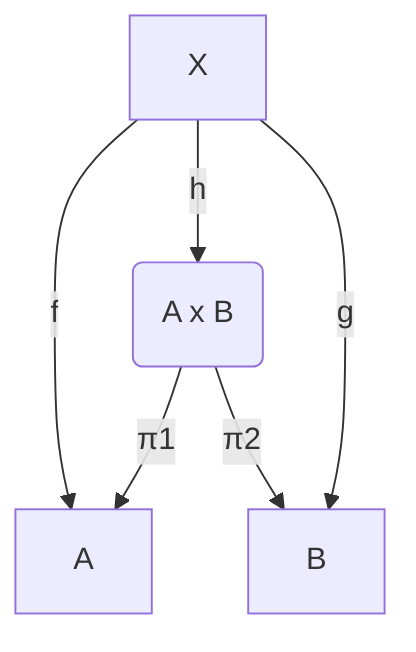
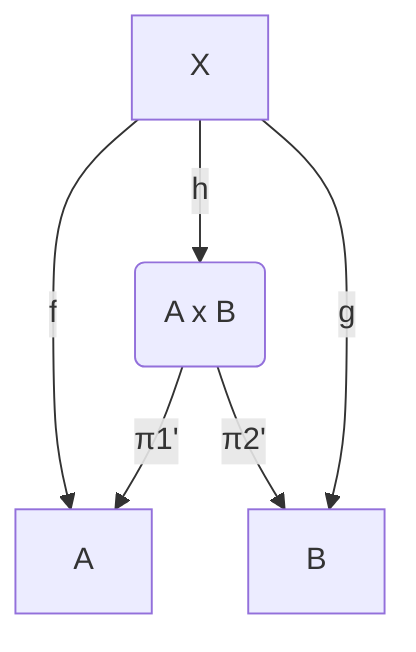
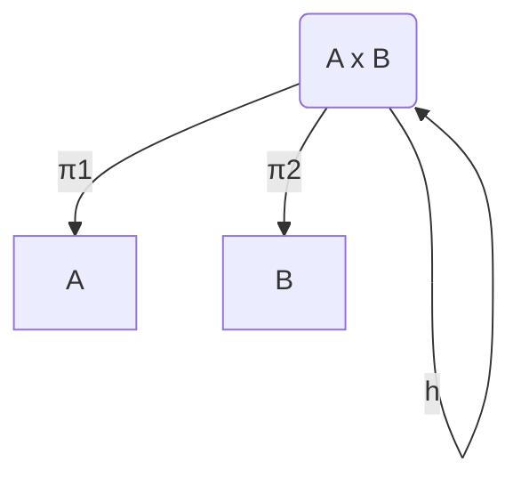
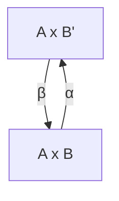
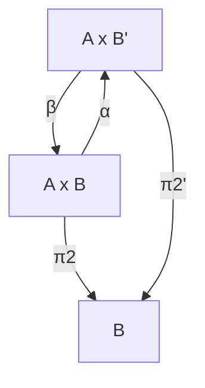
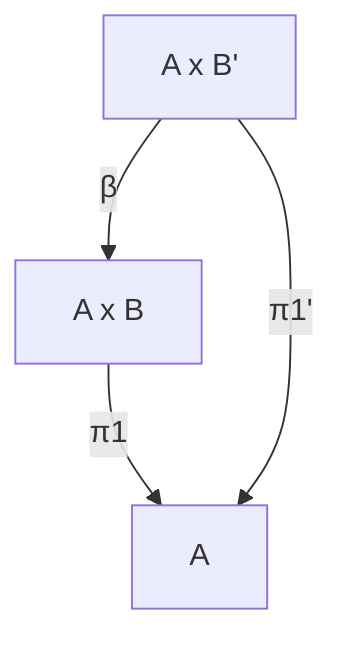
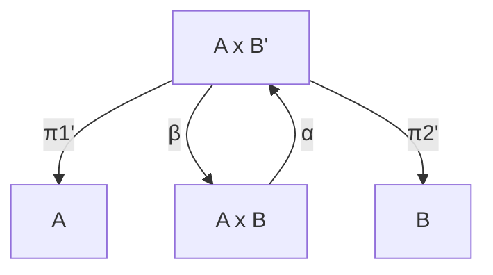

# Universally Defined Product Objects in the Category of Sets

## Introduction:
Category theory plays a crucial role in understanding the structure and
interactions between objects and morphisms in various mathematical contexts. The
category of Sets, which comprises sets as objects and functions between sets as
morphisms, serves as a foundational example for exploring the properties of
product objects. In this essay, we will examine the universal construction of
product objects in the category of Sets and discuss their unique
characteristics.

## Universal Construction: Etymology and Precise Definition

The term "universal construction" stems from the idea that these constructions
capture a universal or general property within a category. Universal
constructions provide a way to define an object and its related morphisms so
that they possess a certain structure or property that holds universally, i.e.,
in a way that is independent of the specific details of the objects or morphisms
involved.

A universal construction can be seen as a solution to a particular problem or a
way of characterizing an object or collection of morphisms that satisfy a given
property. They often involve the use of diagrams that commute, i.e., diagrams in
which any two paths with the same start and endpoints yield the same result when
composed. In this sense, universal constructions provide a higher level of
abstraction that unifies and simplifies various mathematical concepts.

To provide a more precise definition, a universal construction consists of the following components:

- An initial diagram: This is a diagram of objects and morphisms that captures
  the problem or property we want to characterize.

- A universal property: This is a statement that asserts the existence and
  uniqueness of a particular object or morphism in relation to the initial
  diagram. The property typically involves the existence of a unique morphism
  that makes certain diagrams commute.

- A proof of the universal property: This demonstrates that the specified object
  or morphism does indeed satisfy the universal property and that it is unique
  up to isomorphism.

In summary, universal constructions in category theory provide a way to define
objects and their related morphisms in a manner that captures general properties
or structures that hold universally. They offer a powerful tool for unifying and
simplifying various mathematical concepts by abstracting away from the specific
details of objects and morphisms involved.

## Universally Defined Product Object

We will now universally define a Product object, following the principle above.

### Initial Diagram

For any pair of functions

    f: X → A and g: X → B,

We introduce a new object A x B, that we call the Product of A and B

For that, we will later define a morphism h:

    h: X → A x B

Such that

    π₁ ∘ h = f
    π₂ ∘ h = g

In other words, the function h factors
through the product object A x B, making the diagram above commute.

## Definition of a unique product object

We define our product in the following way.

For object X and morphisms f and g:

    Object X:
    morphisms f: X → A and g: X → B

We define:

    Morphism h : X → A x B, h(x)=(f(x), g(x))
    projection morphism π₁: A x B → A, π₁(a,b)=a
    projection morphism π₂: A x B → B, π₂(a,b)=b

It satisfies:

    π₁ ∘ h = f
    π₂ ∘ h = g

Because:

    π₁(h((f(x),g(x))))= f(x)
    π₂(h((f(x),g(x))))= g(x)

Now, we need to prove that h is unique up to isomorphism.
## Proof of universal property
To establish the universal property for the product object, we will demonstrate
that the morphism h: X → A x B is unique up to isomorphism. In other words, if
there exists another morphism h': X → A x B that also satisfies the universal
property conditions, then h and h' are isomorphic.

### Uniqueness of h up to isomorphism
To prove the uniqueness of h up to isomorphism, we will show that if another
morphism h': X → A x B also satisfies the universal property conditions, then h
and h' are equal. In our case, we have a stronger equality than 'unique up to
isomorphism'.

Suppose there exists another morphism h': X → A x B such that:

    π₁ ∘ h' = f
    π₂ ∘ h' = g

We want to show that h'(x) = h(x) for all x ∈ X.

For any x ∈ X:

    (π₁ ∘ h')(x) = f(x)
    (π₂ ∘ h')(x) = g(x)

We have not assumed anything about the structure of h'(x). Instead, we use the fact that π₁ ∘ h' = f and π₂ ∘ h' = g:

    π₁(h'(x)) = f(x)
    π₂(h'(x)) = g(x)

Since h'(x) ∈ A x B, it must be of the form (a, b) where a ∈ A and b ∈ B. We know that

    π₁(h'(x)) = a
    π₂(h'(x)) = b

so we have:

    a = f(x)
    b = g(x)

Thus,

    h'(x) = (a, b) = (f(x), g(x)) = h(x).

Since

    h'(x) = h(x) for all x ∈ X,

we have

    h' = h.

This shows that h is unique, and any other morphism h' satisfying the conditions
of the universal property must be equal to h.

## Uniqueness of π₁ and π₂

To show that the projection morphisms π₁ and π₂ are unique, assume that there
exist alternative projection morphisms π₁': A x B → A and π₂': A x B → B that
also make the diagrams commute:

We want to show that π₁ = π₁' and π₂ = π₂'. Since the morphisms π₁' and π₂' make the diagrams commute, we have:

    π₁' ∘ h = f
    π₂' ∘ h = g

Now consider the diagram where X = A x B, f = π₁, and g = π₂:

By the universal property, there exists a unique morphism h: A x B → A x B such that:

    π₁ ∘ h = π₁
    π₂ ∘ h = π₂

Since the identity morphism id: A x B → A x B also satisfies these conditions:

    π₁ ∘ id = π₁
    π₂ ∘ id = π₂

By the uniqueness of h, we have h = id. Now, using the fact that the diagrams with π₁' and π₂' commute:

    π₁' ∘ h = f = π₁
    π₂' ∘ h = g = π₂

And since h = id:

    π₁' ∘ id = π₁
    π₂' ∘ id = π₂

Which implies:

    π₁' = π₁
    π₂' = π₂

Thus, the projection morphisms π₁ and π₂ are unique.

## Uniqueness of A x B
To show that product objects are unique up to isomorphism, we need to establish
that for any other product object (A x B)', with its respective projection
morphisms π₁' and π₂', there exist isomorphisms α: A x B → (A x B)' and β: (A x
B)' → A x B such that α ∘ β is the identity on (A x B)' and β ∘ α is the
identity on A x B.

Since (A x B)' is also a product object for A and B, we can apply the universal
property of the product object A x B with respect to the alternative projection
morphisms π₁' and π₂':

There exists a unique morphism α: A x B → (A x B)' such that:

    π₁' ∘ α = π₁
    π₂' ∘ α = π₂

Similarly, we can apply the universal property of the product object (A x B)'
with respect to the original projection morphisms π₁ and π₂:

There exists a unique morphism β: (A x B)' → A x B such that:

    π₁ ∘ β = π₁'
    π₂ ∘ β = π₂'

Now we need to show that α and β are inverses of each other.

The rest are proof steps.

### Step 1
We want to show that α ∘ β = id(A x B') for any (a', b') ∈ A x B'. So, let's start by considering an arbitrary element (a', b') in A x B'.

### Step 2
Now, we want to compute (α ∘ β)(a', b'), which is equal to α(β(a', b')).

### Step 3a
π₁'(α(β(a', b'))) = π₁(β(a', b')) since π₁' ∘ α = π₁.

### Step 3b
π₂'(α(β(a', b'))) = π₂(β(a', b')) since π₂' ∘ α = π₂.

### Step 4a
π₁(β(a', b')) = π₁'(a', b') since π₁ ∘ β = π₁'.

### Step 4b
π₂(β(a', b')) = π₂'(a', b') since π₂ ∘ β = π₂'.

### Step 5
Step 3 gave us the following information:

a.

    π₁'(α(β(a', b'))) = π₁(β(a', b')) (because π₁' ∘ α = π₁)
b.

    π₂'(α(β(a', b'))) = π₂(β(a', b')) (because π₂' ∘ α = π₂)

Step 4 provided us with:

a.

    π₁(β(a', b')) = π₁'(a', b') (since π₁ ∘ β = π₁')
b.

    π₂(β(a', b')) = π₂'(a', b') (since π₂ ∘ β = π₂')

Now, combining the information from steps 3 and 4:

    The first component of α(β(a', b')):
    π₁'(α(β(a', b'))) = π₁(β(a', b')) = π₁'(a', b')

    The second component of α(β(a', b')):
    π₂'(α(β(a', b'))) = π₂(β(a', b')) = π₂'(a', b')

### Step 6
Thus, we can now say that α(β(a', b')) has the first component π₁'(a', b') and
the second component π₂'(a', b'), which gives us:

α(β(a', b')) = (π₁'(a', b'), π₂'(a', b'))

### Step 7
Finally, we observe that

    (π₁'(a', b'), π₂'(a', b')) = (a', b')

which implies that

    α(β(a', b')) = (a', b')

Thus, we conclude that

    (α ∘ β)(a', b') = α(β(a', b')) = (a', b')

### Step 8
As this holds for any (a', b') ∈ A x B', we have shown that α ∘ β = id(A x B').

### Step 9
β ∘ α = id(A x B) can be proved in the same fashion as α ∘ β , swapping π₁ with π₁' and π₂ with π₂'

Qed.